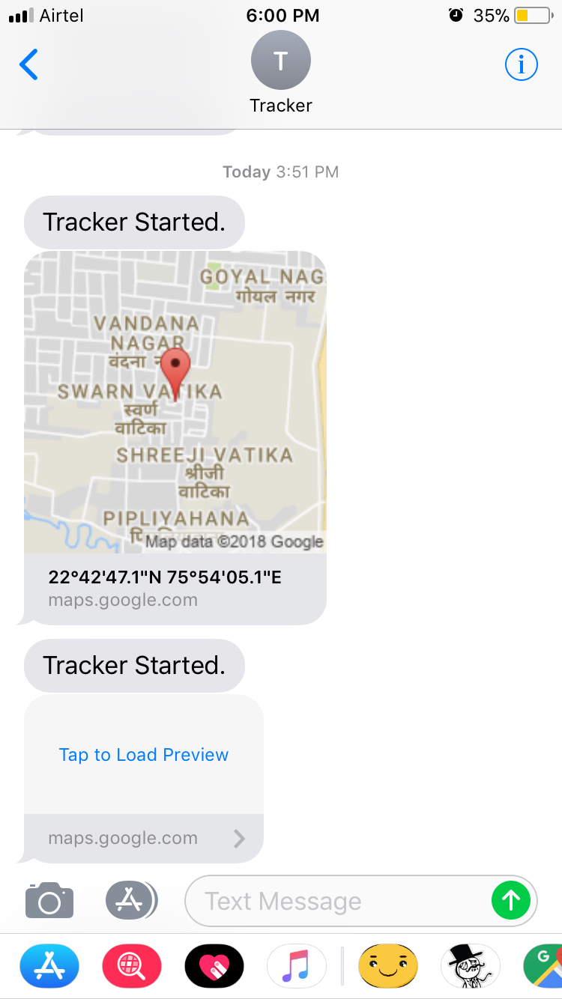

# GPS Tracker with Arduino

A location tracker device which provide geolocation coordinates with speed.

### Introduction

The aim of this project is to build a tracking system to trace the location of any valuable objects or vehicles. This device can also be used for security purposes and for parenting control. This device is so small that it can be easily kept with your belongings.

The device gets the latitude and longitude position with the help of GPS module. It also calculates the speed with which the device is moving and sends an SMS with the help of GSM module with a link for google maps and also the speed of the device. If the device is not receiving GPS signals then it will get the latitude and longitude coordinates with the help of GSM module which is accurate to 1 km. The GSM module finds a tower which is nearest to the device and sends the location of that tower.

### Implementation

This project is based on Arduino. Arduino is an open-source platform. It consists of a physical programmable circuit board and an IDE (Integrated Development Environment)used to write and upload computer code to the physical board. The boards are equipped with sets of digital and analog input/output (I/O) pins that may be interfaced to various expansion boards or GPS and GSM modules. The microcontrollers are typically programmed using a dialect of features from the programming languages C and C++. for the coding purpose, Arduino IDE is used which can be downloaded from its official website. For sending and receiving SMS, AT commands are used. For the location tracing the data is parsed into a link, which is sent as an SMS to the user.

### Hardware Requirements

1. Arduino UNO board
2. GSM Module( SIM800L)
3. GPS Module(NEO-6m)
4. TWO 9V Batteries
5. Switch
6. Connecting wires
7. Antenna for GSM module.

### Design

### Demo of SMS received from tracker

